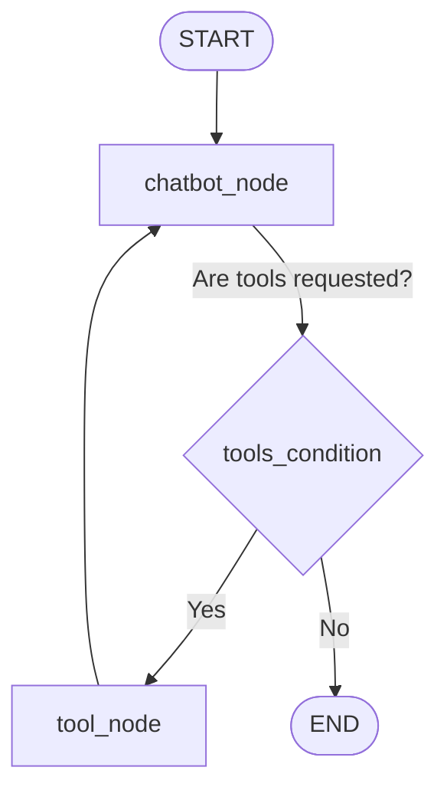

# Nilora - Agentic AI Chatbot System

Nilora is a production-grade, state-of-the-art Agentic AI Chatbot system built with **FastAPI**, **LangChain**, **LangGraph**, and **Google Gemini** models. Inspired by premium modern interfaces like ChatGPT, Nilora delivers natural conversational experiences, real-time web search capability, document-based question answering (RAG), math reasoning, and persistent cross-session memory.

---

## Key Features

*   **Dynamic Multi-Model Support**: Select your preferred Google Gemini model directly from the UI:
    *   `gemini-2.5-flash` (Default)
    *   `gemini-2.5-pro`
    *   `gemini-2.5-flash-lite`
    *   `gemini-1.5-flash`
    *   `gemini-1.5-pro`
*   **Persistent Threading & Session Management**: Sidebar listing recent chats, dynamic auto-generated titles, and local SQLite caching of conversation history.
*   **Long-Term Personalization (Memory)**: Persist user preferences, custom facts, or rules across chats using the `remember_this` and `recall_memory` tools.
*   **In-Chat Document Upload & RAG**: Upload `.pdf`, `.docx`, `.txt`, `.md`, `.py`, or `.csv` files. Extracted text is split into overlapping chunks, embedded using `gemini-embedding-001`, and indexed in an isolated Chroma DB instance filtered by `thread_id` to guarantee thread-level data privacy.
*   **Real-Time Web Search**: Integrates **Tavily Search API** for up-to-date query execution (e.g., current news, release updates, or trending events).
*   **Secure Mathematical Calculator**: Executes mathematical expressions via a restricted evaluation environment with the python `math` module.
*   **SSE Token Streaming**: Streams generated assistant tokens to the browser with Server-Sent Events (SSE) `/chat/stream` while hiding intermediate tool execution states.
*   **Speech-to-Text Dictation**: Native microphone integration leveraging the browser's Web Speech API.

---

## System Architecture & LangGraph Workflow

Nilora's reasoning capabilities are constructed as a LangGraph state machine:



1.  **`chatbot_node`**: Binds the Gemini model to the toolset. Prepends the system prompt defining Nilora's personality and rules.
2.  **`tools_condition`**: Analyzes the model output. If the agent requested a tool call, routes control to the tools node.
3.  **`tool_node`**: Executes the requested tool (Tavily search, SQLite memory operation, Chroma vector store query, calculator) and appends a `ToolMessage` to the state, cycling back to the chatbot node.
4.  **`SqliteSaver`**: Uses a LangGraph checkpointer SQLite database to serialize state configurations across thread executions, enabling seamless resumption of long context histories.

---

## Directory Structure

```text
.
├── agent.py               # LangGraph state machine & Gemini model bindings
├── app.py                 # FastAPI server, SSE stream routes, and upload endpoints
├── database.py            # SQLite database initialization & memory CRUD operations
├── dockerfile             # Docker container definition
├── rag.py                 # RAG pipeline (document parsing, chunking, vectorstore)
├── requirements.txt       # Project python dependencies
├── test.py                # Command-line streaming verification script
├── tools.py               # Custom tools (Calculator, Memory tools, RAG, Tavily)
├── .env                   # Environment API secrets and configurations (ignored by git)
│
├── chroma_db/             # Local directory housing persistent Chroma vector store
├── data/                  # SQLite databases (memories.db, langgraph_checkpoints.sqlite)
├── templates/
│   └── index.html         # Rich HTML/CSS/JS frontend template
└── uploads/               # Temporary storage for uploaded documents
```

---

## 🛠️ Tool Specifications

1.  **`calculator`**: Safe math parser execution (`math.sqrt`, arithmetic, `abs`, `round`).
2.  **`search_uploaded_documents`**: Similarity matching against uploaded documents in Chroma DB, filtered by the current thread ID.
3.  **`remember_this`**: Stores long-term user preferences in the `memories` table.
4.  **`recall_memory`**: Recalls stored thread preferences matching input query terms (defaults to 10 most recent if query is empty).
5.  **`web_search`** (Tavily): Executes advanced web queries for news, trends, and recent real-world information.

---

## Installation & Configuration

### Prerequisites
*   Python 3.10 or 3.11
*   Google Gemini API Key
*   Tavily Search API Key

### Setup Instructions
1.  Clone this repository.
2.  Create and activate a virtual environment:
    ```bash
    python -m venv .venv
    source .venv/bin/activate  # On Windows: .venv\Scripts\activate
    ```
3.  Install dependencies:
    ```bash
    pip install -r requirements.txt
    ```
4.  Create a `.env` file in the root folder with the following variables:
    ```ini
    GOOGLE_API_KEY="your-gemini-api-key-here"
    GOOGLE_MODEL="gemini-2.5-flash"
    TAVILY_API_KEY="your-tavily-api-key-here"

    # LangSmith Tracing (Optional)
    LANGSMITH_API_KEY="your-langsmith-api-key"
    LANGSMITH_TRACING="true"
    LANGSMITH_ENDPOINT="https://api.smith.langchain.com"
    LANGSMITH_PROJECT="Nilora - agentic chatbot"
    ```

---

## Running the Application

### Local Development
To launch the FastAPI development server:
```bash
python app.py
```
Or start via Uvicorn:
```bash
uvicorn app:app --host 0.0.0.0 --port 8080 --reload
```
Open your browser and navigate to `http://localhost:8080/`.

### CLI Testing
Verify your Gemini credentials and LangGraph trace pipelines independently using `test.py`:
```bash
python test.py
```

---

## 🐳 Docker Deployment

To build and run the chatbot as a container:

1.  **Build the Image**:
    ```bash
    docker build -t nilora-chatbot:latest .
    ```
2.  **Run the Container**:
    ```bash
    docker run -p 8080:8080 \
        -e GOOGLE_API_KEY="your-gemini-key" \
        -e TAVILY_API_KEY="your-tavily-key" \
        nilora-chatbot:latest
    ```
    The application will run at `http://localhost:8080/`.